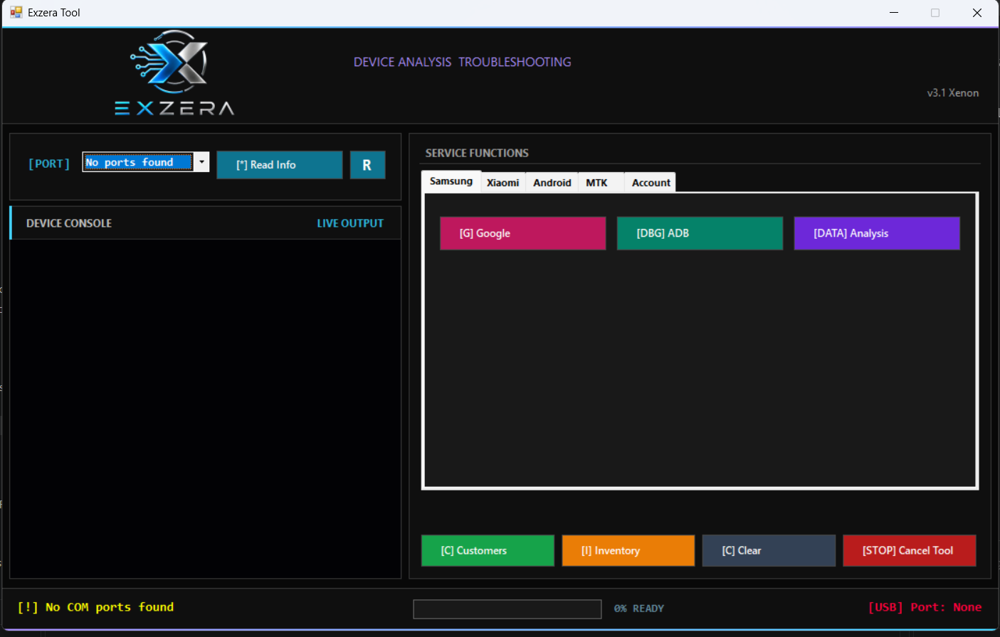

# Exzera Tool

Exzera Tool is a Windows desktop application for device information, service workflows, security review, and workshop administration. It brings commonly used device and business-management functions together in a clear tabbed interface.

> This repository contains product documentation and screenshots only. It does not contain the application, utilities, binaries, or source code.

## Highlights

- Read connected-device information from a selected port.
- Organize service functions by Samsung, Xiaomi, Android, MTK, and Account categories.
- Review live operation output and progress in the device console.
- Track installed applications against known threat records and identify suspected viruses, malware, adware, and unwanted applications.
- Remove or disable detected threats after review and confirmation.
- Remember previously removed threats to improve future Smart Removal sessions.
- Clear supported browser cache and stored browsing data during the cleaning workflow.
- Trim temporary system cache to help remove leftover files and recover storage space.
- Provide device-activation workflows for compatible phones through the available Samsung, Xiaomi, Android, and MTK service areas.
- Manage customer service cases and delivery status.
- Track spare-parts inventory by device model.
- Start supported device-analysis and service workflows from one interface.
- Stop an active operation from the main window.

## Documentation

- [Feature Overview](Documentation/FEATURES.md)
- [User Guide](Documentation/USER-GUIDE.md)
- [Safety and Responsible Use](Documentation/SAFETY.md)

## Platform

- Microsoft Windows
- A compatible device and the appropriate device-side settings may be required for individual functions.

## Notice

Exzera Tool is intended for lawful diagnostics, maintenance, and service work on devices that you own or are authorized to service. Availability of individual functions can vary by device model, software version, and account status.

## Author

Powered by Samer Al Birkdar.
